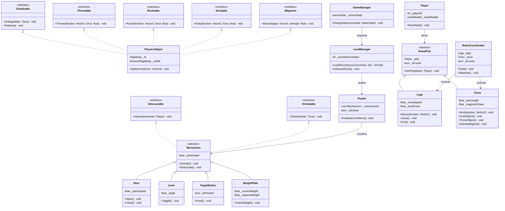
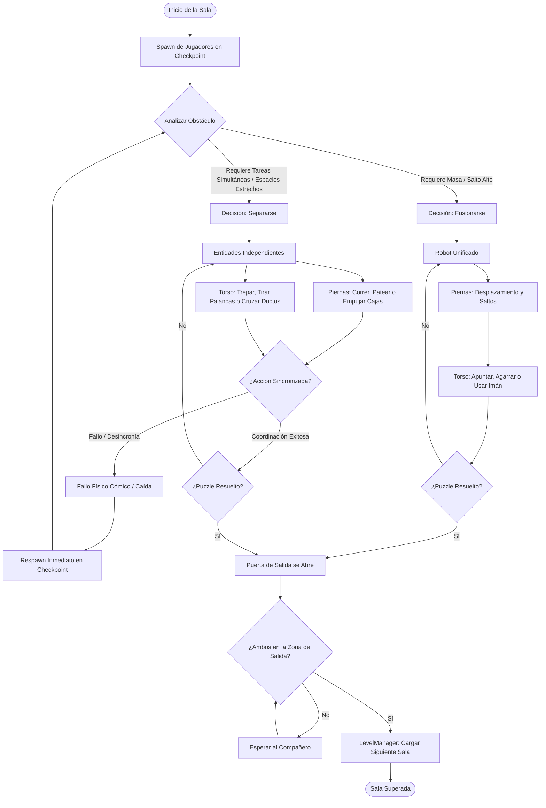
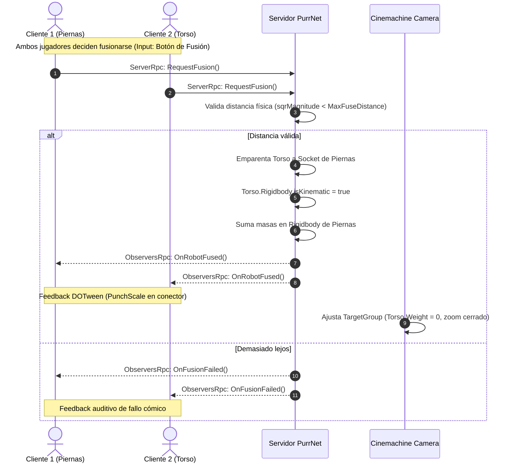

# 📊 Diagramas de Sistema: Two Pilots, One Robot (TPOB)

Esta sección contiene los diagramas técnicos del proyecto expresados en sintaxis nativa de **Mermaid**, renderizables directamente en Obsidian y Notion.

---

## 🏛️ 1. Diagrama de Clases (Arquitectura de Entidades y Puzzles)

---

## 🔁 2. Flujograma del Loop de Gameplay (Decision Loop)

---

## 📡 3. Secuencia de Red: Fusión Autoritativa con PurrNet y UniTask

