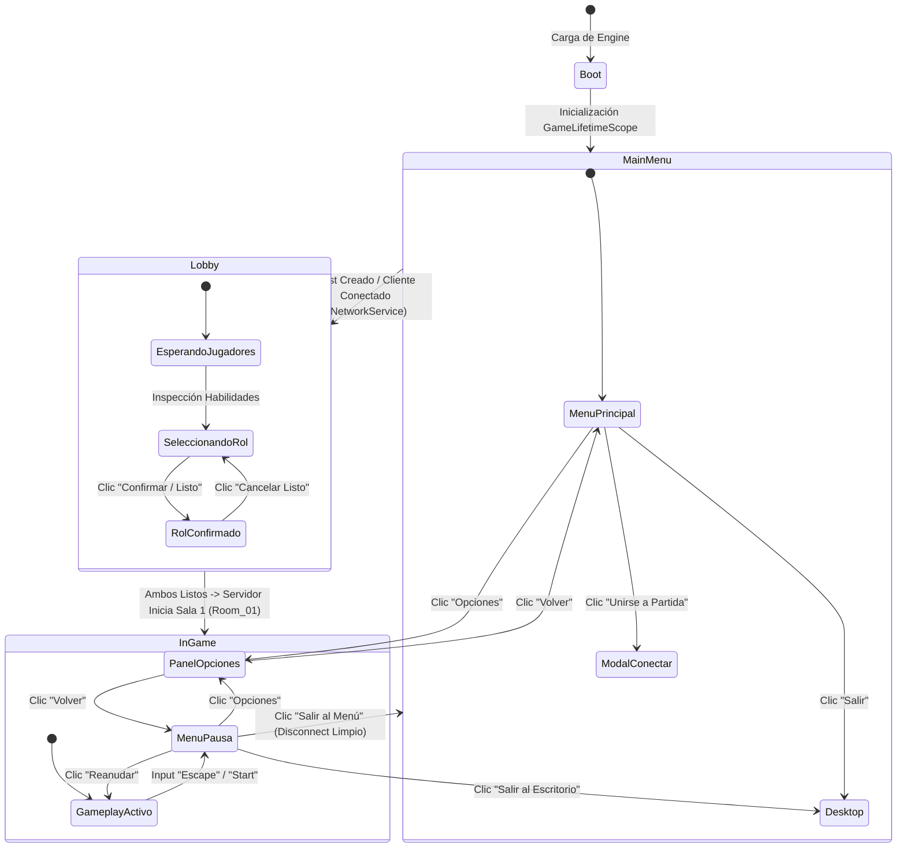

# 🎮 Documentación Técnica y Plan de Implementación: Menú Principal, Lobby y Menú de Pausa

Este documento detalla la arquitectura de software, los contratos de red y el plan de implementación por fases para los sistemas de interfaz de usuario de **Two Pilots, One Robot (TPOB)**:
1. **Menú Principal**: Creación de partida (`Host`), conexión por IP/Puerto (`Connect`), panel de opciones (`Settings`) y salida (`Exit`).
2. **Lobby de Pre-Ingreso**: Selección exclusiva de roles (**Piernas** vs **Torso**) con prevención autoritativa de duplicados, alternancia pre-confirmación, visualización detallada de habilidades y controles de cada parte, y arranque sincronizado de la campaña.
3. **Menú de Pausa In-Game**: Suspensión segura de inputs en red (sin congelar `Time.timeScale`), reanudar, acceso a opciones y desconexión limpia hacia el menú principal.

---

## 🧭 Diagrama de Flujo y Estados de Navegación



---

## 📋 Resumen de Fases

| Fase | Denominación | Stack Tecnológico | Entregable Principal |
| :---: | :--- | :--- | :--- |
| **Fase 1** | **Infraestructura de Datos, Red y Eventos** | PurrNet, VContainer, C# Structs | `LobbyNetworkController`, extensión de `PlayerSlot` (`IsReady`), RPCs autoritativos con `bufferLast: true`. |
| **Fase 2** | **Menú Principal y Sistema de Opciones** | UGUI, TextMeshPro, IAudioService, PlayerPrefs | `Canvas_MainMenu`, conexión IP/puerto, diálogo modal de opciones (Audio, Video, Sensibilidad) y salida. |
| **Fase 3** | **Lobby de Pre-Ingreso y Selección Exclusiva** | PurrNet ServerRpc, ObserversRpc, DOTween | `Canvas_Lobby`, tarjetas interactivas de *Piernas* y *Torso*, visualizador de controles/lore, exclusión mutua y arranque de Sala 1. |
| **Fase 4** | **Menú de Pausa In-Game y Desconexión Limpia** | UnityEngine.InputSystem, INetworkService | `Canvas_PauseMenu`, overlay con cursor liberado, suspensión local de `LegsInputReader`/`TorsoInputReader` y salida segura. |
| **Fase 5** | **Integración de Prefabs, Escenas y Automatización** | Game.Editor, CanvasScaler, Unity Build Settings | Prefabs estandarizados a 1080p, wiring en `GameLifetimeScope` y botones de prueba en Unity Editor. |

---

## ⚙️ FASE 1: Infraestructura de Datos, Red y Eventos

### 1.1 Objetivo
Establecer la sincronización autoritativa del estado de selección de roles en PurrNet antes de instanciar los avatares físicos en la escena de juego.

### 1.2 Reglas de Red PurrNet Obligatorias (Ver [[AGENTS.md]])
1. **Herencia directa:** `LobbyNetworkController` hereda de `NetworkBehaviour` (que ya incorpora `NetworkIdentity`). No añadir componentes redundantes.
2. **Autoridad en solicitudes:** Los clientes usan `[ServerRpc(requireOwnership: false)]` para solicitar cambio de rol o alternar el estado de listo.
3. **Persistencia visual:** Toda sincronización hacia observadores se realiza mediante `[ObserversRpc(runLocally: true, bufferLast: true)]`. Esto garantiza que si un cliente tarda milisegundos más en unirse, PurrNet reproduce inmediatamente el estado consolidado de roles y confirmaciones.

### 1.3 Modificación del Modelo de Datos (`PlayerSlot.cs`)
En `Assets/_Project/Core/Structs/PlayerSlot.cs`, agregar el flag inmutable `IsReady`:
```csharp
namespace Game.Core.Enums
{
    public readonly struct PlayerSlot : IEquatable<PlayerSlot>
    {
        public int PlayerId { get; }
        public PlayerRole Role { get; }
        public bool IsLocal { get; }
        public bool IsReady { get; }

        public PlayerSlot(int playerId, PlayerRole role, bool isLocal, bool isReady = false)
        {
            PlayerId = playerId;
            Role = role;
            IsLocal = isLocal;
            IsReady = isReady;
        }

        public bool Equals(PlayerSlot other) =>
            PlayerId == other.PlayerId && Role == other.Role && IsLocal == other.IsLocal && IsReady == other.IsReady;

        public override bool Equals(object obj) => obj is PlayerSlot other && Equals(other);
        public override int GetHashCode() => HashCode.Combine(PlayerId, (int)Role, IsLocal, IsReady);
    }
}
```

### 1.4 Controlador de Red: `LobbyNetworkController.cs`
Ruta: `Assets/_Project/Network/Services/LobbyNetworkController.cs`

```csharp
using System;
using Cysharp.Threading.Tasks;
using Game.Core.Enums;
using Game.Core.Interfaces;
using PurrNet;
using UnityEngine;
using VContainer;

namespace Game.Network.Services
{
    [DisallowMultipleComponent]
    public sealed class LobbyNetworkController : NetworkBehaviour
    {
        [Inject] private readonly IPlayerRegistry _playerRegistry;
        [Inject] private readonly ILevelManager _levelManager;

        public event Action<int, PlayerRole, bool> OnPlayerStateSynchronized;
        public event Action<bool> OnBothPlayersReadyStatusChanged;

        private int _legsPlayerId = -1;
        private int _torsoPlayerId = -1;
        private bool _legsReady;
        private bool _torsoReady;

        public bool AreBothPlayersReady => _legsPlayerId != -1 && _torsoPlayerId != -1 && _legsReady && _torsoReady;

        [ServerRpc(requireOwnership: false)]
        public void RequestRoleSelectionServerRpc(int playerId, PlayerRole requestedRole)
        {
            if (!isServer) return;

            // Validación de exclusividad: Si el rol ya está bloqueado y confirmado por otro jugador, se descarta
            if (requestedRole == PlayerRole.Legs && _legsPlayerId != -1 && _legsPlayerId != playerId && _legsReady)
                return;

            if (requestedRole == PlayerRole.Torso && _torsoPlayerId != -1 && _torsoPlayerId != playerId && _torsoReady)
                return;

            // Desasignar rol previo
            if (_legsPlayerId == playerId) { _legsPlayerId = -1; _legsReady = false; }
            if (_torsoPlayerId == playerId) { _torsoPlayerId = -1; _torsoReady = false; }

            // Asignación con desplazamiento si no está confirmado
            if (requestedRole == PlayerRole.Legs)
            {
                if (_legsPlayerId != -1 && _legsPlayerId != playerId)
                {
                    _torsoPlayerId = _legsPlayerId;
                    _torsoReady = false;
                }
                _legsPlayerId = playerId;
            }
            else if (requestedRole == PlayerRole.Torso)
            {
                if (_torsoPlayerId != -1 && _torsoPlayerId != playerId)
                {
                    _legsPlayerId = _torsoPlayerId;
                    _legsReady = false;
                }
                _torsoPlayerId = playerId;
            }

            BroadcastLobbyState();
        }

        [ServerRpc(requireOwnership: false)]
        public void RequestToggleReadyServerRpc(int playerId)
        {
            if (!isServer) return;

            if (_legsPlayerId == playerId) _legsReady = !_legsReady;
            else if (_torsoPlayerId == playerId) _torsoReady = !_torsoReady;

            BroadcastLobbyState();
        }

        [ServerRpc(requireOwnership: false)]
        public void RequestStartGameServerRpc()
        {
            if (!isServer || !AreBothPlayersReady) return;

            // Iniciar la Sala 1 autoritativamente
            _levelManager.LoadRoomAsync(0).Forget();
        }

        private void BroadcastLobbyState()
        {
            SyncLobbyStateObserversRpc(_legsPlayerId, _legsReady, _torsoPlayerId, _torsoReady);
        }

        [ObserversRpc(runLocally: true, bufferLast: true)]
        private void SyncLobbyStateObserversRpc(int legsId, bool legsReady, int torsoId, bool torsoReady)
        {
            _legsPlayerId = legsId;
            _legsReady = legsReady;
            _torsoPlayerId = torsoId;
            _torsoReady = torsoReady;

            if (legsId != -1) _playerRegistry.TryAssignRole(legsId, PlayerRole.Legs);
            if (torsoId != -1) _playerRegistry.TryAssignRole(torsoId, PlayerRole.Torso);

            OnPlayerStateSynchronized?.Invoke(legsId, PlayerRole.Legs, legsReady);
            OnPlayerStateSynchronized?.Invoke(torsoId, PlayerRole.Torso, torsoReady);
            OnBothPlayersReadyStatusChanged?.Invoke(AreBothPlayersReady);
        }
    }
}
```

---

## 🖥️ FASE 2: Menú Principal y Sistema de Opciones

### 2.1 Objetivo
Diseñar una interfaz responsiva que permita:
- Iniciar como **Host** (`INetworkService.StartHost(port)`).
- Conectarse como **Cliente** indicando IP y Puerto (`INetworkService.StartClient(ip, port)`).
- Modificar ajustes persistentes (Audio, Video y Sensibilidad).
- Salir del juego con confirmación.

### 2.2 Estructura de Componentes MVP

#### `MainMenuView.cs` (Vista Pasiva)
```csharp
using TMPro;
using UnityEngine;
using UnityEngine.UI;

namespace Game.Gameplay.UI
{
    [DisallowMultipleComponent]
    public sealed class MainMenuView : MonoBehaviour
    {
        [Header("Botones Principales")]
        [SerializeField] private Button _hostButton;
        [SerializeField] private Button _openConnectModalButton;
        [SerializeField] private Button _optionsButton;
        [SerializeField] private Button _exitButton;

        [Header("Modal de Conexión")]
        [SerializeField] private GameObject _connectModalRoot;
        [SerializeField] private TMP_InputField _ipInputField;
        [SerializeField] private TMP_InputField _portInputField;
        [SerializeField] private Button _confirmConnectButton;
        [SerializeField] private Button _cancelConnectButton;

        [Header("Diálogo de Opciones")]
        [SerializeField] private GameObject _settingsDialogRoot;

        public Button HostButton => _hostButton;
        public Button OpenConnectModalButton => _openConnectModalButton;
        public Button OptionsButton => _optionsButton;
        public Button ExitButton => _exitButton;

        public GameObject ConnectModalRoot => _connectModalRoot;
        public TMP_InputField IpInputField => _ipInputField;
        public TMP_InputField PortInputField => _portInputField;
        public Button ConfirmConnectButton => _confirmConnectButton;
        public Button CancelConnectButton => _cancelConnectButton;

        public GameObject SettingsDialogRoot => _settingsDialogRoot;
    }
}
```

#### `MainMenuPresenter.cs` (Lógica de Interacción)
```csharp
using Game.Core.Interfaces;
using UnityEngine;
using VContainer;
using VContainer.Unity;

namespace Game.Gameplay.UI
{
    public sealed class MainMenuPresenter : IInitializable, System.IDisposable
    {
        private readonly MainMenuView _view;
        private readonly INetworkService _networkService;

        [Inject]
        public MainMenuPresenter(MainMenuView view, INetworkService networkService)
        {
            _view = view;
            _networkService = networkService;
        }

        public void Initialize()
        {
            _view.HostButton.onClick.AddListener(OnHostClicked);
            _view.OpenConnectModalButton.onClick.AddListener(OnOpenConnectModalClicked);
            _view.ConfirmConnectButton.onClick.AddListener(OnConfirmConnectClicked);
            _view.CancelConnectButton.onClick.AddListener(OnCancelConnectClicked);
            _view.OptionsButton.onClick.AddListener(OnOptionsClicked);
            _view.ExitButton.onClick.AddListener(OnExitClicked);

            _view.ConnectModalRoot.SetActive(false);
            if (_view.SettingsDialogRoot != null) _view.SettingsDialogRoot.SetActive(false);
        }

        private void OnHostClicked()
        {
            ushort port = ushort.TryParse(_view.PortInputField.text, out var p) ? p : (ushort)5000;
            _networkService.StartHost(port);
        }

        private void OnOpenConnectModalClicked()
        {
            _view.ConnectModalRoot.SetActive(true);
        }

        private void OnConfirmConnectClicked()
        {
            string ip = string.IsNullOrWhiteSpace(_view.IpInputField.text) ? "127.0.0.1" : _view.IpInputField.text.Trim();
            ushort port = ushort.TryParse(_view.PortInputField.text, out var p) ? p : (ushort)5000;

            _networkService.StartClient(ip, port);
            _view.ConnectModalRoot.SetActive(false);
        }

        private void OnCancelConnectClicked() => _view.ConnectModalRoot.SetActive(false);
        private void OnOptionsClicked() => _view.SettingsDialogRoot.SetActive(true);

        private void OnExitClicked()
        {
#if UNITY_EDITOR
            UnityEditor.EditorApplication.isPlaying = false;
#else
            Application.Quit();
#endif
        }

        public void Dispose()
        {
            _view.HostButton.onClick.RemoveAllListeners();
            _view.OpenConnectModalButton.onClick.RemoveAllListeners();
            _view.ConfirmConnectButton.onClick.RemoveAllListeners();
            _view.CancelConnectButton.onClick.RemoveAllListeners();
            _view.OptionsButton.onClick.RemoveAllListeners();
            _view.ExitButton.onClick.RemoveAllListeners();
        }
    }
}
```

### 2.3 Panel de Opciones (`SettingsView.cs` & `SettingsPresenter.cs`)
Permite calibrar y persistir:
1. **Volumen General (Master)**: Aplica sobre `IAudioService.SetMasterVolume(val)`.
2. **Volumen de Efectos (SFX)**: Aplica sobre `IAudioService.SetSfxVolume(val)`.
3. **Resolución y Modo de Pantalla**: Fullscreen Exclusive / Borderless / Windowed (`Screen.SetResolution`).
4. **Sincronización Vertical (VSync)**: `QualitySettings.vSyncCount = enabled ? 1 : 0`.
5. **Sensibilidad de Control**: Guardado en `PlayerPrefs.SetFloat("AimSensitivity", val)`.

---

## 🤝 FASE 3: Lobby de Pre-Ingreso y Selección Exclusiva

### 3.1 Objetivo
Permitir que los dos jugadores:
1. Inspeccionen dinámicamente las habilidades y controles de **Piernas** y **Torso**.
2. Seleccionen un rol libremente mientras no confirmen.
3. Garanticen exclusividad: no pueden escoger ambos la misma parte una vez confirmados.
4. El Host pueda iniciar la partida una vez que ambos jugadores pulsen **"Listo"**.

### 3.2 Ficha de Habilidades y Controles (Contenido Textual de la UI)

```
========================================================================================
🦵 ROL: PIERNAS (Locomoción, Salto y Fuerza Bruta)
========================================================================================
• DESCRIPCIÓN:
  Chasis bípedo motorizado responsable del transporte del robot y la apertura de pasos
  bloqueados mediante demolición física.

• HABILIDADES PRINCIPALES:
  - Salto / Doble Salto: Supera plataformas elevadas y fosas de ácido.
  - Sprint Acelerado: Atraviesa compuertas temporizadas a alta velocidad.
  - Patada de Impacto Físico: Empuja bloques balísticos, activa botones de pared y aturde.
  - Base de Fusión: Soporta el peso del Torso y suministra energía de locomoción.

• CONTROLES (Teclado / Gamepad):
  [W, A, S, D] / [Stick Izquierdo]  --> Moverse y pivotar
  [Espacio]    / [Botón A (Sur)]    --> Saltar / Doble salto en el aire
  [Shift Izq]  / [Gatillo Izq (LT)] --> Sprint / Carrera rápida
  [F]          / [Botón X (Oeste)]  --> Patada física hacia adelante
  [R]          / [Botón Y (Norte)]  --> Iniciar / Terminar acople con Torso

========================================================================================
🤖 ROL: TORSO (Manipulación, Puntería y Electromagnetismo)
========================================================================================
• DESCRIPCIÓN:
  Unidad cerebral y manipuladora con torreta independiente 360°, brazos hidráulicos y
  emisor magnético de largo alcance.

• HABILIDADES PRINCIPALES:
  - Agarre y Manipulación: Levanta cubos de energía, llaves magnéticas y baterías.
  - Lanzamiento Balístico: Arroja objetos con parábola precisa a interruptores lejanos.
  - Rayo Magnético Tractor: Atrae objetos metálicos o permite balanceos tácticos.
  - Oruga Autónoma: Rueda por ductos estrechos cuando está separado de las piernas.
  - Torreta Superior: Apunta y dispara en 360° montado sobre las piernas en movimiento.

• CONTROLES (Teclado / Gamepad):
  [Mouse]        / [Stick Derecho]    --> Puntería direccional en 360°
  [Click Izq / E]/ [Gatillo Der (RT)] --> Agarrar / Soltar / Interactuar con palanca
  [Click Der / Q]/ [Botón RB]         --> Cargar y lanzar objeto con impulso
  [Shift / C]    / [Gatillo Izq (LT)] --> Activar Rayo Magnético tractor continuo
  [W, A, S, D]   / [Stick Izquierdo]  --> Rodar sobre oruga (cuando está desacoplado)
  [R]            / [Botón Y (Norte)]  --> Iniciar / Terminar acople con Piernas
========================================================================================
```

### 3.3 Lógica de Exclusión en `LobbyView.cs`

```csharp
using TMPro;
using UnityEngine;
using UnityEngine.UI;

namespace Game.Gameplay.UI
{
    [DisallowMultipleComponent]
    public sealed class LobbyView : MonoBehaviour
    {
        [Header("Tarjeta Piernas")]
        [SerializeField] private Button _selectLegsButton;
        [SerializeField] private TextMeshProUGUI _legsStatusText;
        [SerializeField] private CanvasGroup _legsCanvasGroup;

        [Header("Tarjeta Torso")]
        [SerializeField] private Button _selectTorsoButton;
        [SerializeField] private TextMeshProUGUI _torsoStatusText;
        [SerializeField] private CanvasGroup _torsoCanvasGroup;

        [Header("Confirmación y Comienzo")]
        [SerializeField] private Button _readyToggleButton;
        [SerializeField] private TextMeshProUGUI _readyButtonText;
        [SerializeField] private Button _startGameButton;
        [SerializeField] private TextMeshProUGUI _matchStatusInfoText;

        public Button SelectLegsButton => _selectLegsButton;
        public TextMeshProUGUI LegsStatusText => _legsStatusText;
        public CanvasGroup LegsCanvasGroup => _legsCanvasGroup;

        public Button SelectTorsoButton => _selectTorsoButton;
        public TextMeshProUGUI TorsoStatusText => _torsoStatusText;
        public CanvasGroup TorsoCanvasGroup => _torsoCanvasGroup;

        public Button ReadyToggleButton => _readyToggleButton;
        public TextMeshProUGUI ReadyButtonText => _readyButtonText;
        public Button StartGameButton => _startGameButton;
        public TextMeshProUGUI MatchStatusInfoText => _matchStatusInfoText;

        public void UpdateRoleCard(PlayerRole role, bool isOccupied, bool isReady, bool isLocal)
        {
            var cg = role == PlayerRole.Legs ? _legsCanvasGroup : _torsoCanvasGroup;
            var text = role == PlayerRole.Legs ? _legsStatusText : _torsoStatusText;
            var btn = role == PlayerRole.Legs ? _selectLegsButton : _selectTorsoButton;

            if (!isOccupied)
            {
                cg.alpha = 1f;
                btn.interactable = true;
                text.text = "<color=#888888>[ DISPONIBLE ]</color>";
            }
            else if (isLocal)
            {
                cg.alpha = 1f;
                btn.interactable = !isReady;
                text.text = isReady 
                    ? "<color=#55FF55><b>✔ TU SELECCIÓN (LISTO)</b></color>" 
                    : "<color=#00FFFF><b>● TU SELECCIÓN (PENDIENTE)</b></color>";
            }
            else
            {
                // Ocupado por el compañero
                cg.alpha = isReady ? 0.4f : 0.8f;
                btn.interactable = false;
                text.text = isReady 
                    ? "<color=#FF5555><b>🔒 OCUPADO (CONFIRMADO)</b></color>" 
                    : "<color=#FFAA00><b>COMPAÑERO ELIGIENDO...</b></color>";
            }
        }
    }
}
```

---

## ⏸️ FASE 4: Menú de Pausa In-Game y Desconexión Limpia

### 4.1 Objetivo
1. Desplegar un menú modal con las opciones: **Continuar**, **Opciones** y **Salir al Menú Principal**.
2. **Pausa contextual en red:** En multijugador cooperativo, no se utiliza `Time.timeScale = 0` (ello rompería la sincronización de PhysX y el lag compensation de PurrNet). En su lugar:
   - Se suspende la lectura de entrada del avatar local desactivando `LegsInputReader` y `TorsoInputReader`.
   - Se libera el cursor (`CursorLockMode.None`, `Cursor.visible = true`).
   - Se atenúa la escena con un panel translúcido (`CanvasGroup`).
3. Al salir al menú principal, se invoca `INetworkService.Disconnect()`, reseteando `PlayerRegistry` y retornando a la escena inicial (`Boot`).

### 4.2 Lógica en `PauseMenuController.cs`

```csharp
using Game.Core.Enums;
using Game.Core.Interfaces;
using Game.Gameplay.Player.Legs;
using Game.Gameplay.Player.Torso;
using UnityEngine;
using UnityEngine.InputSystem;
using VContainer;

namespace Game.Gameplay.UI
{
    [DisallowMultipleComponent]
    public sealed class PauseMenuController : MonoBehaviour
    {
        [SerializeField] private GameObject _pauseRoot;
        [SerializeField] private GameObject _settingsDialog;

        [Inject] private readonly IGameManager _gameManager;
        [Inject] private readonly INetworkService _networkService;
        [Inject] private readonly ILevelManager _levelManager;

        private bool _isPaused;

        private void Start()
        {
            SetPauseActive(false);
        }

        private void Update()
        {
            var keyboard = Keyboard.current;
            var gamepad = Gamepad.current;

            bool pausePressed = (keyboard != null && keyboard.escapeKey.wasPressedThisFrame) ||
                                (gamepad != null && gamepad.startButton.wasPressedThisFrame);

            if (pausePressed)
            {
                TogglePause();
            }
        }

        public void TogglePause()
        {
            _isPaused = !_isPaused;
            SetPauseActive(_isPaused);

            // 1. Alternar inputs de jugador local
            var legsInput = FindFirstObjectByType<LegsInputReader>();
            if (legsInput != null) legsInput.enabled = !_isPaused;

            var torsoInput = FindFirstObjectByType<TorsoInputReader>();
            if (torsoInput != null) torsoInput.enabled = !_isPaused;

            // 2. Gestionar cursor
            Cursor.lockState = _isPaused ? CursorLockMode.None : CursorLockMode.Locked;
            Cursor.visible = _isPaused;

            // 3. Cambiar estado de juego
            _gameManager?.ChangeState(_isPaused ? GameState.Paused : GameState.InGame);
        }

        public void ResumeGame() => TogglePause();

        public void OpenSettings()
        {
            if (_settingsDialog != null) _settingsDialog.SetActive(true);
        }

        public void DisconnectAndReturnToMenu()
        {
            Cursor.lockState = CursorLockMode.None;
            Cursor.visible = true;

            _networkService?.Disconnect();
            UnityEngine.SceneManagement.SceneManager.LoadScene("Boot");
        }

        public void ExitToDesktop()
        {
#if UNITY_EDITOR
            UnityEditor.EditorApplication.isPlaying = false;
#else
            Application.Quit();
#endif
        }

        private void SetPauseActive(bool active)
        {
            if (_pauseRoot != null) _pauseRoot.SetActive(active);
        }
    }
}
```

---

## 🏗️ FASE 5: Integración de Prefabs, Escenas y Automatización

### 5.1 Estructura en la Escena `Boot.unity`
En `Boot.unity` (la escena índice 0):
1. **`--- UI ---`**:
   - `Canvas_MainMenu` (activa por defecto al arrancar).
   - `Canvas_Lobby` (desactivada, se enciende cuando `_gameManager.CurrentState == GameState.Lobby`).
   - `Dialog_Settings` (desactivada, compartida como overlay).
2. **`[GAME_LIFETIME_SCOPE]`**:
   - Mantiene registrado `LobbyNetworkController` como componente singleton de red.
   - Resuelve las inyecciones de `MainMenuPresenter` y `LobbyPresenter`.

### 5.2 Estructura en las Escenas de Salas (`Room_01` a `Room_10`)
1. **`Canvas_PauseMenu`**:
   - Prefab instanciado en cada sala o montado persistentemente bajo un Scope global con `DontDestroyOnLoad`.
   - Contiene el `PauseMenuController` conectado al EventBus y al nuevo Input System.

---

## 🧪 Matriz de Validación y Criterios de Aceptación (QA)

| Caso de Prueba | Condición de Entrada | Acción | Resultado Esperado |
| :--- | :--- | :--- | :--- |
| **TC-01: Host Local** | Menú Principal activo. | Clic en *"Crear Partida (Host)"*. | `NetworkManager` inicia Host, la UI oculta el Menú y abre el Lobby. |
| **TC-02: Join Cliente** | Host ya iniciado en puerto 5000. | Cliente ingresa `127.0.0.1:5000` y clic *"Conectar"*. | Cliente conecta; ambos ven sus ranuras de jugador en el Lobby. |
| **TC-03: Exclusión de Roles** | Jugador 1 selecciona Piernas y pulsa *"Listo"*. | Jugador 2 intenta hacer clic en Piernas. | Tarjeta de Piernas bloqueada para Jugador 2. Solo puede elegir Torso. |
| **TC-04: Alternancia Dinámica** | Ningún jugador ha confirmado ("Listo"). | Jugador 1 alterna entre Piernas y Torso. | El rol cambia en tiempo real sin bloquear al compañero. |
| **TC-05: Inicio Sincronizado** | Ambos jugadores con *"Listo"*. | Host pulsa *"Iniciar Partida"*. | Servidor llama `LoadRoomAsync(0)`. Spawner instancia a Piernas y Torso con los roles elegidos. |
| **TC-06: Pausa In-Game** | En plena partida de `Room_01`. | Presionar `Escape` o `Start`. | Se abre la pausa, se libera el mouse y el robot local deja de responder a WASD. El compañero sigue conectado. |
| **TC-07: Salida al Menú** | Partida en pausa. | Clic en *"Salir al Menú"*. | Cierre limpio de socket PurrNet, descarga de sala y regreso a `Boot.unity` sin memory leaks ni errores. |

---

## 📚 Enlaces de Interés Relacionados
- [[00_Index|Centro de Documentación]]
- [[02_Arquitectura|Arquitectura de Software y PurrNet]]
- [[04_Plan_de_Implementacion|Plan de Implementación de Campaña (14 Fases)]]
- [AGENTS.md](file:///c:/Users/SaidR/Documents/GitHub/TPOB/AGENTS.md)
